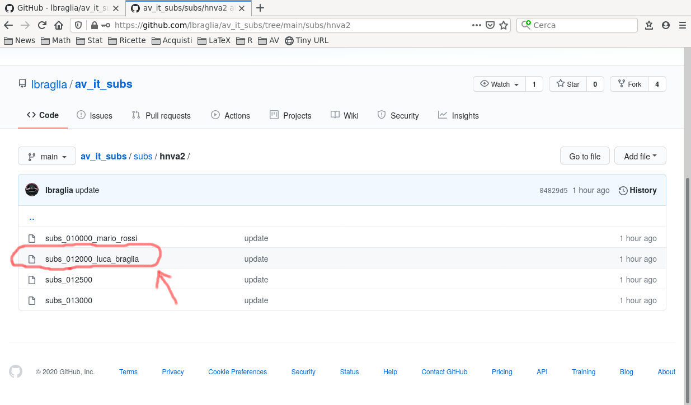
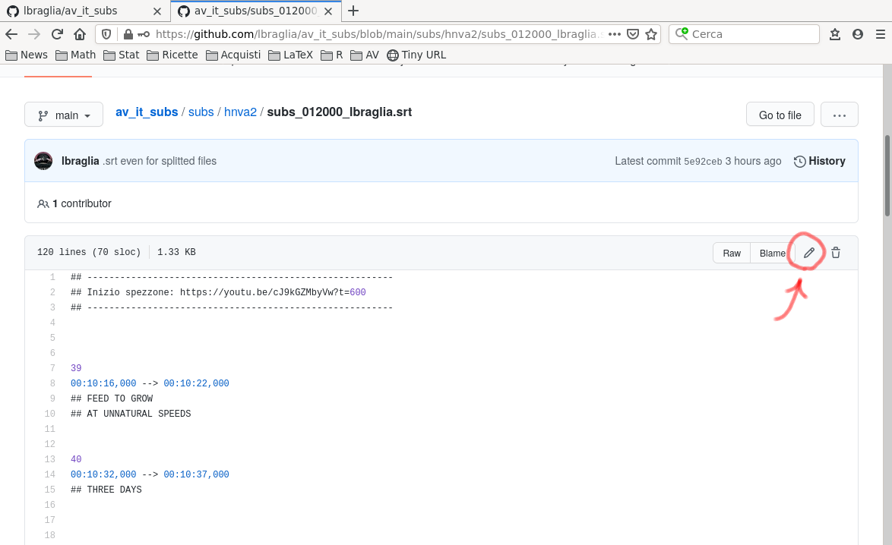
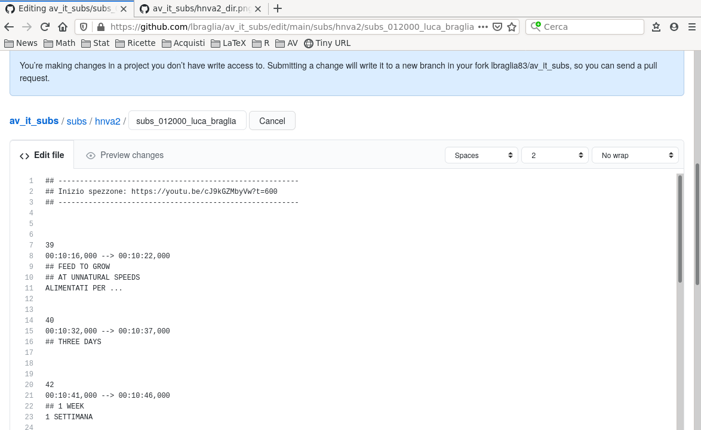
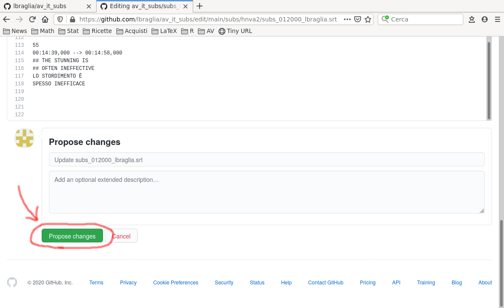
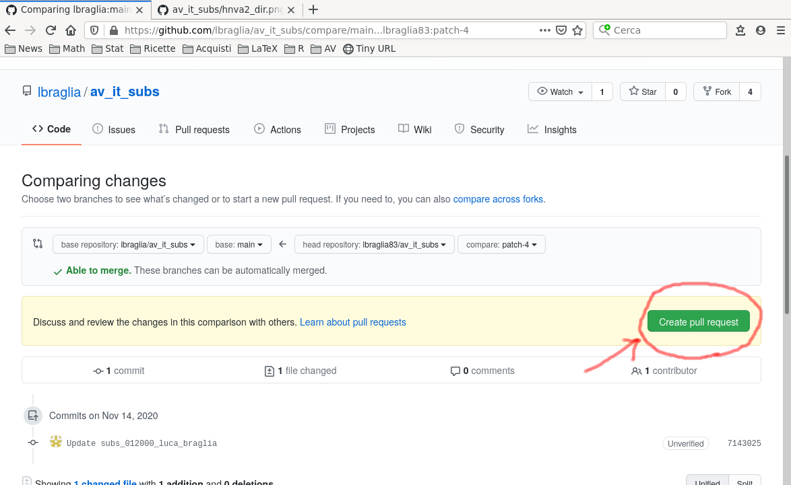
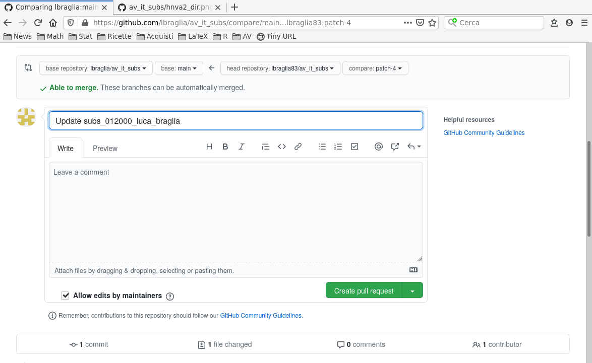
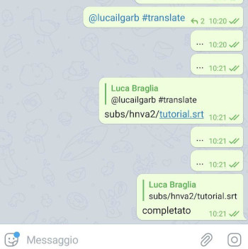

# AV subs (IT)

## Progetti attivi

id   | Originale | Per traduzione | Per revisione | Finale
:---:|:---------:|:--------------:|:-------------:|:-----:
hnva2| [Video](https://youtu.be/cJ9kGZMbyVw) | [Video](https://youtu.be/Jaok_8MNntQ) | Video | Video


## Setup/Overview

Per poter contribuire alla traduzione, dopo aver letto le [linee
guida](https://drive.google.com/file/d/1IACZxWdk84rs81ElQ9OWws-aroQZDtxZ/view?usp=sharing)
occorre:

1. creare (gratuitamente) un account su
   [GitHub](https://www.github.com) ("Sign Up" e seguire la procedura
   sino a verificare la mail);
   
2. comunicarmi lo username GitHub con cui intendete collaborare, per
   [abilitazione](data/users.csv). 

	Verrà risposto un nome file di prova: tradurlo e sottomettere la
	revisione, *come illustrato nel seguito* (occorre leggere fino a
	fine pagina per saper cosa/come fare).
	
	Una volta fatto, se ci si sente ragionevolmente a proprio agio con
    la procedura di modifica/sottomissione si può passare allo step
    successivo, alternativamente si può chiedere
	
	```
	@lucailgarb #sandbox
	```
	per la predisposizione di un altro file di prova;

3. per richiedere l'assegnazione di uno spezzone di sottotitoli postare:
   
	```
	@lucailgarb #translate
	```
4. in seguito, *i revisori abilitati* potranno richiedere
   l'assegnazione di uno spezzone da revisionare mediante:
   
	```
	@lucailgarb #revise
	```


## Formato sottotitoli 

I sottotitoli sono in formato `.srt` ossia un file di testo (tipo
`.txt`) con una struttura precisa, da rispettare/non modificare.

Ad esempio, di seguito uno stralcio per i primi secondi del video che usiamo
ai cubi:

```
1
00:00:00,000 --> 00:00:01,200
Prodotti caseari

2
00:00:02,000 --> 00:00:24,000
Inseminazione forzata

3
00:00:33,000 --> 00:00:49,000
Separazione dei neonati

4
00:00:51,000 --> 00:01:04,000
Questa è una pratica standard
```

Vi è dunque:
* un numero progressivo del sottotitolo;
* i secondi di inizio e fine della sua visualizzazione;
* il testo (che può essere organizzato su più righe);
* una linea bianca di separazione.

Questo è quello a cui dobbiamo, *alla fine di tutto*, arrivare.


## Come/cosa modificare
Per permettere la **revisione** delle traduzioni noi lavoreremo su un file
*lievemente diverso*, che includa sia l'originale che la traduzione.
Questo è simile a quello che troverete:
```
3
00:00:33,000 --> 00:00:49,000
## Newborn separation


4
00:00:51,000 --> 00:01:04,000
## This is standard practice


```

Quello che dovrete fare è la cosa seguente: 
* lasciare tutto immutato;
* aggiungere la linea tradotta in italiano sotto a quella inglese;
* lasciare sempre una linea di spazio alla fine.

Come segue:
```
3
00:00:33,000 --> 00:00:49,000
## Newborn separation
Separazione dei neonati


4
00:00:51,000 --> 00:01:04,000
## This is standard practice
Questa è pratica standard


```


## Istruzioni per i traduttori

Per lavorare alle traduzioni:

0. da **computer**, effettuare il login su [GitHub](https://www.github.com);

1. aprire [questa](https://github.com/lbraglia/av_it_subs) pagina, dove sono
   conservate le traduzioni;

2. nel gruppo Telegram "AV: Traduzioni e Sub YouTube" postare:

	```
	@lucailgarb #translate
	```
	Per richiedere l'assegnazione di un file da tradurre.
	Verrà risposto (quanto prima) un messaggio con la posizione del 
	file, del tipo:
	
	```
	subs/hnva2/subs_012000_lbraglia.srt
	```
	che sta a significare: ti è stato assegnato
	
	* il file `subs_012000_lbraglia.srt` (uno
	spezzone di sottotitoli che inizia approssimativamente a
	`01:20:00` nel video) 
	* che si trova nella cartella `hnva2` (che contiene i sottotitoli
	per "Holding Non-Vegans Accountable 2.0") 
	* posta nella cartella `subs` (che racchiude tutti i
	sottotitoli di tutti i video).

3. cliccare quindi sulla cartella `subs`
   
   

4. cliccare sulla cartella del video (`hnva2` nell'esempio)

	

5. arrivati a questo punto conviene **salvare questa pagina nei
   preferiti** (per accedervi facilmente alle prossime sessioni)
   perché tutte i file di un dato video si trovano qui e si
   velocizzerà l'accesso al file assegnato.

   Cliccare dunque sul nome del file che ci è stato assegnato
   (`subs_012000_lbraglia.srt` nell'esempio);

   

6. ora **visionare il lavoro da fare nel suo complesso**, seguendo [le
   istruzioni riportate qui](help.md);

7. **una volta chiara la traduzione da effettuare nel suo complesso**,
   puoi cliccare sul pulsante matita per procedere alla modifica del
   file (quello a destra dei bottoni `Raw` e `Blame`);

   

8. fare le modifiche/tradurre (non preoccuparsi del messaggio "You are
   making changes ...")
   
   

   Se si vuole avere un sommario delle modifiche effettuate spostarsi
   nel tab `Preview changes`;

9. a termine sessione, quando si vuole "salvare", scorrere in basso
   nella pagina, verso la sezione `Propose changes`: cliccare sul
   tasto verde `Propose changes`

	

10. cliccare sul pulsante verde `Create Pull Request`
   
   

11. cliccare su `Create Pull Request`;

	

12. fine!! 


In seguito a revisione informatica di minima le modifiche saranno
accettate ed integrate: modifiche che impattino su qualsiasi cosa
diversa dalla traduzione (es progressivo sottotitolo, secondi)
saranno verosimilmente rifiutate.
	
Ora, se si è **terminato** il proprio file:
* attendere accettazione/merge (comunicata automaticamente via mail);
* *dare comunicazione* in chat che la modifica del file assegnato è
  completa (per motivi logistici, aka "sbloccare" la revisione). 
  
  Il modo migliore per farlo è rispondere all'assegnazione (per
  trovarla *cercare il proprio username GitHub* nella chat) con un
  messaggio del tipo "completato"/"terminato". Es

	
 
  
* si può procedere a richiesta di un nuovo file da modificare, re-iniziando
  dal punto 2.

Se viceversa **occorre finire** il file assegnato, ri-cominciare dal
punto 7 (tener conto che le modifiche in precedenza apportate non
saranno visualizzate, se non sono state nel frattempo
approvate. Tuttavia sono state sottomesse/non perse).


## Istruzioni per i revisori

Per poter effettuare revisioni, dopo aver letto le [linee
guida](https://drive.google.com/file/d/1IACZxWdk84rs81ElQ9OWws-aroQZDtxZ/view?usp=sharing)
occorre:

1. creare (gratuitamente) un account su
   [GitHub](https://www.github.com) ("Sign Up" e seguire la procedura
   sino a verificare la mail);
   
2. comunicarmi lo username GitHub con cui intendete collaborare, per
   [abilitazione](data/users.csv);
	
	Verrà risposto un nome file di prova: revisionare correggendo la
	traduzione italiana. Informaticamente l'attività di revisione
	segue gli stessi modi di quella di traduzione; per tale aspetto,
	quindi, fare riferimento a quanto riportato in precedenza.
	
	Una volta fatto, se ci si sente ragionevolmente a proprio agio con
    la procedura si può passare allo step successivo, altrimenti è
    possibile chiedere

	```
	@lucailgarb #sandbox
	```
	per richiedere la predisposizione di un altro file di prova; 


4. periodicamente (quando disponibili) nel gruppo Telegram "AV:
   Traduzioni e Sub YouTube" verrà comunicata la disponibilità di file
   per la revisione. Si può richiedere una assegnazione mediante:
   
	```
	@lucailgarb #revise
	```
