# Istruzioni per revisori


Risorse | Link 
--------|:----:
Obbligatorie | [[Guidelines linguistiche]](https://drive.google.com/file/d/1IACZxWdk84rs81ElQ9OWws-aroQZDtxZ/view?usp=sharing),  [[Guidelines leggibilità]](guidelines.md), [[Aegisub]](http://www.aegisub.org/)
Consigliate | [[Telegram Web]](https://web.telegram.org), [[Telegram Desktop]](https://desktop.telegram.org/)

## Setup
Per poter effettuare revisioni per un dato video, dopo aver letto le
[guidelines linguistiche](https://drive.google.com/file/d/1IACZxWdk84rs81ElQ9OWws-aroQZDtxZ/view?usp=sharing)
occorre:

0. installare [Aegisub](http://www.aegisub.org/), il programma con cui
   verrà controllato il proprio spezzone. 
   
   Per quanto riguarda Windows è possibile eventualmente optare per la
   versione portabile (che non richiede installazione e quindi i
   permessi di amministratore sulla macchina);

1. per abilitazione alle richieste di revisione, correggere e inviarmi
   (Telegram o a lbraglia@gmail.com) il file di prova
   [`subs/sandbox/revs_sandbox.srt`](https://raw.githubusercontent.com/lbraglia/av_it_subs/main/subs/sandbox/revs_sandbox.srt)
   (come spiegato in seguito) che è basato sul [questo
   video](https://drive.google.com/file/d/1sCzIOzn6hRy0mvu3zgorERCDX_3IwRH0/view?usp=sharing)
   (da scaricare);

2. una volta ottenuta abilitazione, scaricare il video senza
   sottotitoli su cui stiamo lavorando: il link si trova nella [pagina
   principale](../README.md), ad esempio (per hnva2) qui:

	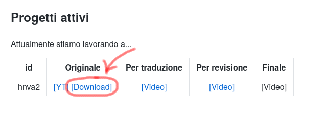

3. periodicamente (quando disponibili) nel gruppo Telegram "AV:
   Traduzioni e Sub YouTube" verrà comunicata la disponibilità di file
   per la revisione. Si può richiedere una assegnazione mediante:
   
	```
	@lucailgarb #revise
	```


## Il file su cui lavoriamo per la revisione

Il file su cui dobbiamo operare attraverso Aegisub:

* è stato creato durante il processo di traduzione ed è il collage di
  più file sequenziali prodotti da traduttori diversi (tipicamente);

* include solamente la traduzione in italiano, dato che per l'inglese
  è disponibile l'audio originale (attraverso il caricamento del
  video);
  
* presenta eventuali commenti lasciati ai revisori come ultima linea
  di sottotitolo, preceduta da `# REVISORI: ...`. Ad esempio
  in presenza di un commento a video verrà visualizzato:
  
  ```
                    Testo tradotto
                   Testo tradotto 2
  # REVISORI: qui nel dubbio si è optato per XYZ perché ...
  ```
  Ovviamente, una volta risolto il punto, il commento per i revisori 
  andrà cancellato. Incidentalmente la presenza di commenti tenderà ad 
  essere segnalata da metriche di caratteri, per ovvi motivi;

* in corrispondenza dei sub di inizio file per un traduttore è stato
  posto il commento `# REVISORI: primo sub di spezzone`, per segnalare
  l'esigenza di continuità tra quello che precede e quello che segue
  (prodotto da revisori differenti/indipendentemente).


## Il processo step-by-step

Per lavorare alle revisioni:

1. periodicamente (quando disponibili) nel gruppo Telegram "AV:
   Traduzioni e Sub YouTube" verrà comunicata la disponibilità di file
   per la revisione. Si può richiedere una assegnazione mediante:
   
	```
	@lucailgarb #revise
	```
	
	Verrà risposto (quanto prima) un messaggio con la posizione del
	file, del tipo:

	```
	subs/hnva2/revs_000000_002500_lbraglia.srt
	```
	che sta a significare: ti è stato assegnato

	* il file `revs_000000_002500_lbraglia.srt` (uno
	spezzone di sottotitoli che include da quelli aventi inizio a
	`00:00:00` a quelli aventi inizio a `00:25:00`)
	* che si trova nella cartella `hnva2` (che contiene i sottotitoli
	per "Holding Non-Vegans Accountable 2.0")
	* posta nella cartella `subs` (che racchiude tutti i
	sottotitoli di tutti i video).


2. aprire [questa](https://github.com/lbraglia/av_it_subs) pagina, dove sono
   conservate le traduzioni;

3. cliccare quindi sulla cartella `subs`

   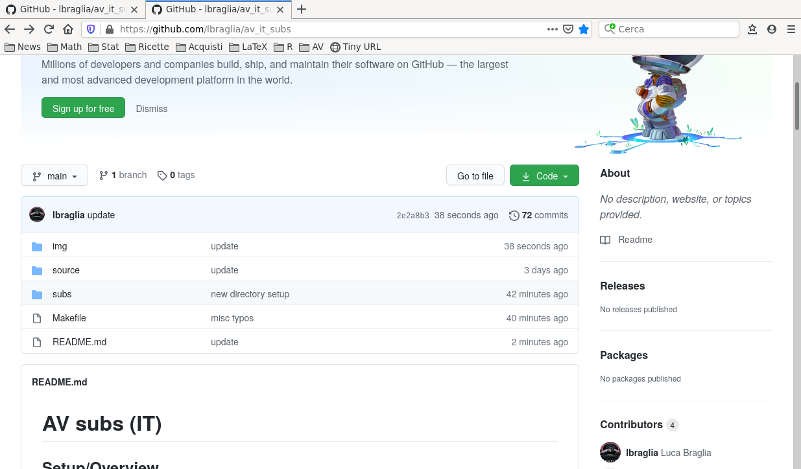

4. cliccare sulla cartella del video (`hnva2` nell'esempio)

	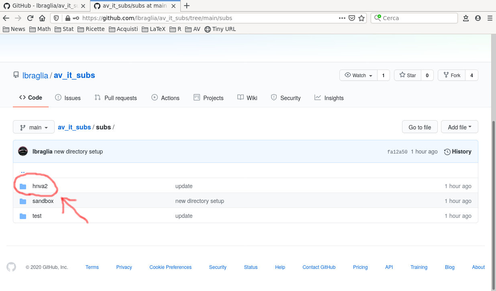

5. arrivati a questo punto conviene **salvare questa pagina nei
   preferiti** (per accedervi facilmente alle prossime sessioni)
   perché tutte i file di un dato video si trovano qui e si
   velocizzerà l'accesso al file assegnato.

   Cliccare dunque sul nome del file che ci è stato assegnato
   (`revs_000000_002500_lbraglia.srt` nell'esempio);

   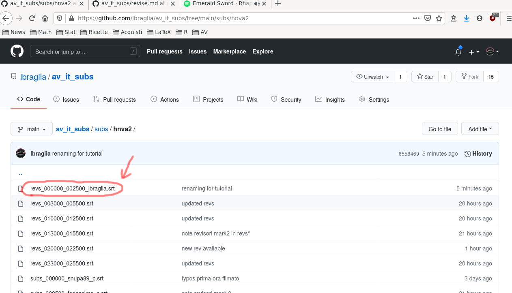

6.  Cliccare su `Raw` per ottenere il file;

   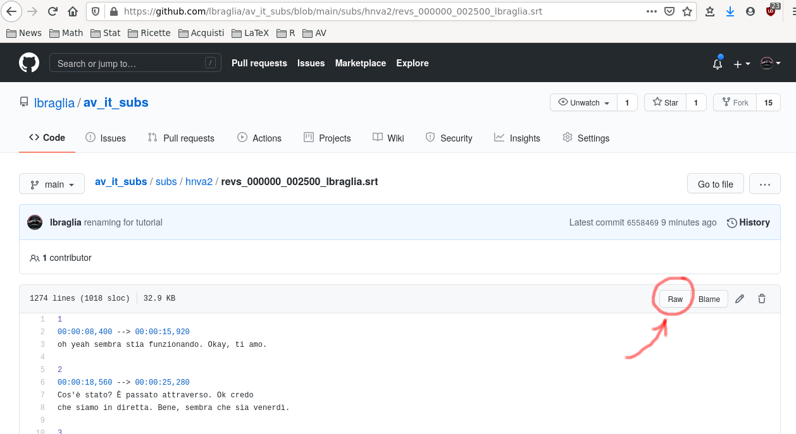

7.  Ora per fare il download del file:

	* in Firefox: cliccare col pulsante destro, selezionare "Salva pagina con nome" o qualcosa di linguisticamente analogo
	* in Chrome: cliccare col destro, selezionare "Salva con nome..." o qualcosa di linguisticamente analogo
	
	Dopodiché **cancellare** eventuali estensioni `.txt` se proposte dal proprio browser (mentre il "Salva come" è irrilevante)


   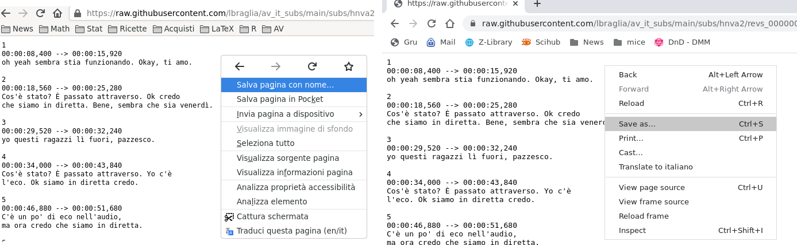

	
   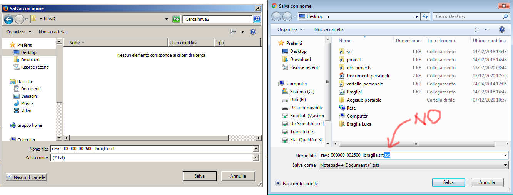


8. arrivati a questo punto dovremmo avere sia il video che i subs da editare
   in una opportuna cartella (oppure sul Desktop):

   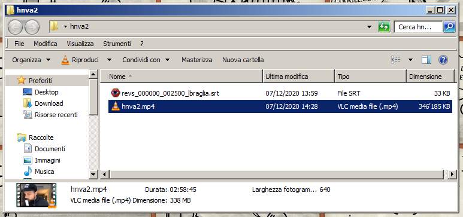

9. fare doppio click sul file `.srt` per fare in modo che Aegisub lo
    inizi ad editare.
	
	Se compare un messaggio del tipo "Aegisub non può restringere il
	set di caratteri" scegliere `UTF-8`.
	
	Arriviamo ad una schermata analoga:
	
   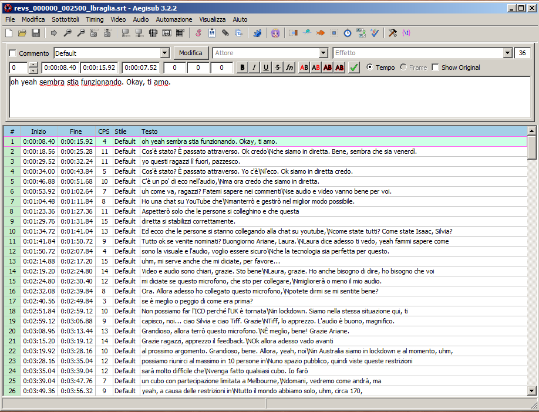

10. per caricare il video cliccare `Video -> Apri video`, dopodiché 
	selezionarlo:

   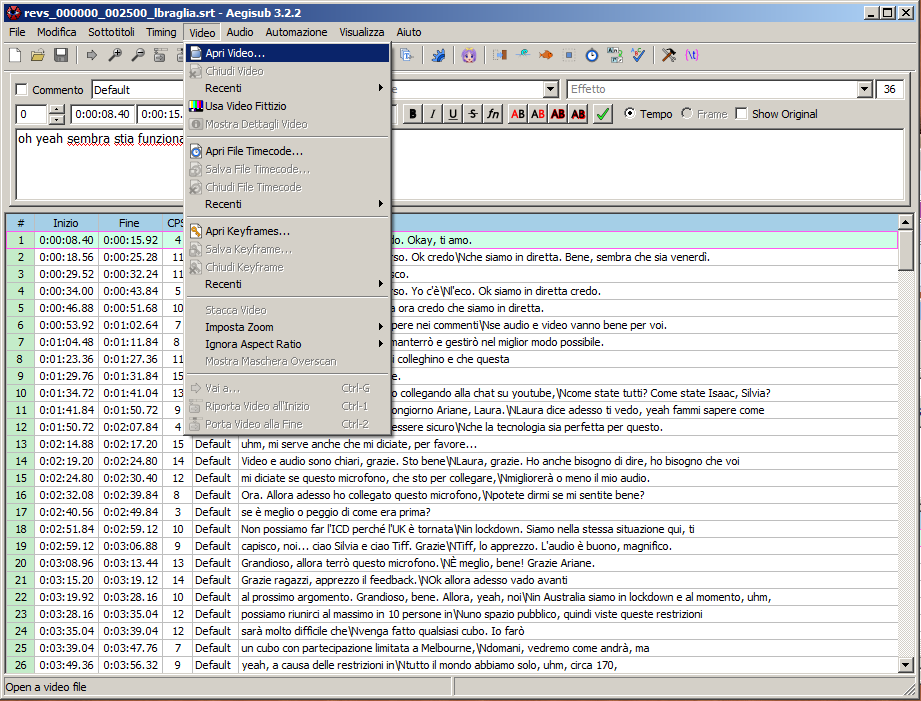

11. una volta importato il file ci troviamo in una situazione del
	genere, dove si consiglia massimizzare la finestra a tutto
	schermo, porre A al 100% e si possono editare i sottotitoli
	nel riquadro B

   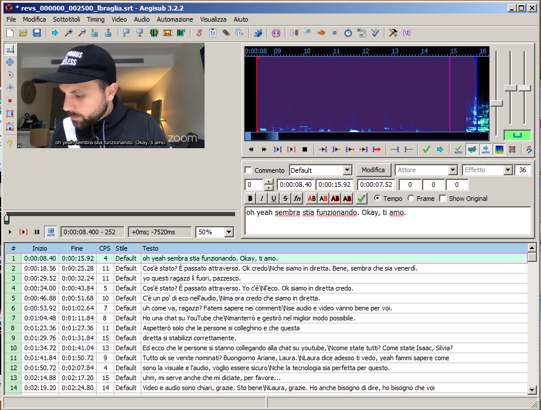

12. iniziare il controllo/editing seguendo quanto consigliato [più
	sotto](revise.md#editing-con-aegisub);

13. Importante: **salvare** il lavoro e fare i **backup** del file
    `.srt` editato;

14. una volta concluso l'editing del proprio spezzone, rinominare il
    file aggiungendo un `_c` (per "completo", nell'esempio
    `revs_000000_002500_lbraglia_c.srt`) ed inviarmelo (come si
    preferisce, Telegram o lbraglia@gmail.com) per archiviazione e per
    produzione dell'`.srt` complessivo.
	
15. *repeat* da 1.


# Editing con Aegisub

Un *workflow* minimale:
1. cliccare sulla prima riga (sub);
2. schiacciare `r` per riprodurre l'audio del sub;
3. controllare la traduzione e se necessario metterla a posto editando 
   nell'apposito riquadro. 
      
   In particolar modo controllare:
   * **corretta resa in italiano** di quello che viene detto in
	 inglese, seguendo le [guidelines linguistiche](https://drive.google.com/file/d/1IACZxWdk84rs81ElQ9OWws-aroQZDtxZ/view?usp=sharing);
   * **leggibilità** del sub, facendo riferimento 
	 alle relative [guidelines](guidelines.md).

   Evitare di modificare:
   * formattazione (per compatibilità);
   * *timing* dei sottotitoli (a meno che si sappia esattamente cosa si
	 stia facendo).

   Se necessario spezzare linee inserire/spostare `\N` (ottenibile
   anche, nel riquadro di editing B, mediante `Shift+Invio`);

4. se si sono apportate modifiche, salvare con `Ctrl+S`;
5. muoversi al prossimo sottotitolo cliccando la rispettiva linea col
   tasto sinistro del mouse;
6. *repeat* da 2;
7. una volta editati tutti i sottotitoli si può dare un check
   complessivo facendo doppio click sul primo sub e comandando
   `Ctrl+P` per riprodurre il video con i sottotitoli rivisti.


## Ottenere aiuto
In caso di dubbi/difficoltà:

* per **aspetti linguistici** non esitare a chiedere un parere/aiuto al gruppo
  "AV: Traduttori e Revisori" seguendo [queste istruzioni](help.md);
* per **aspetti informatici** contattami direttamente.
