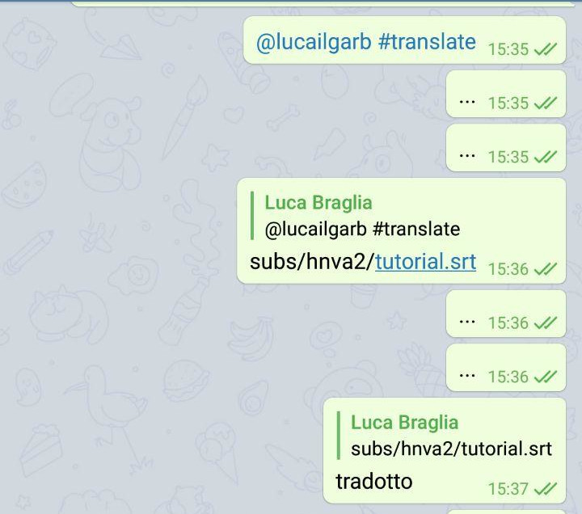
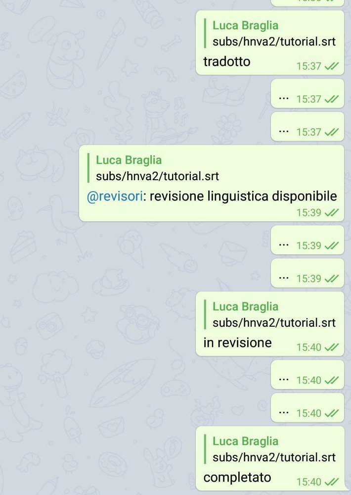
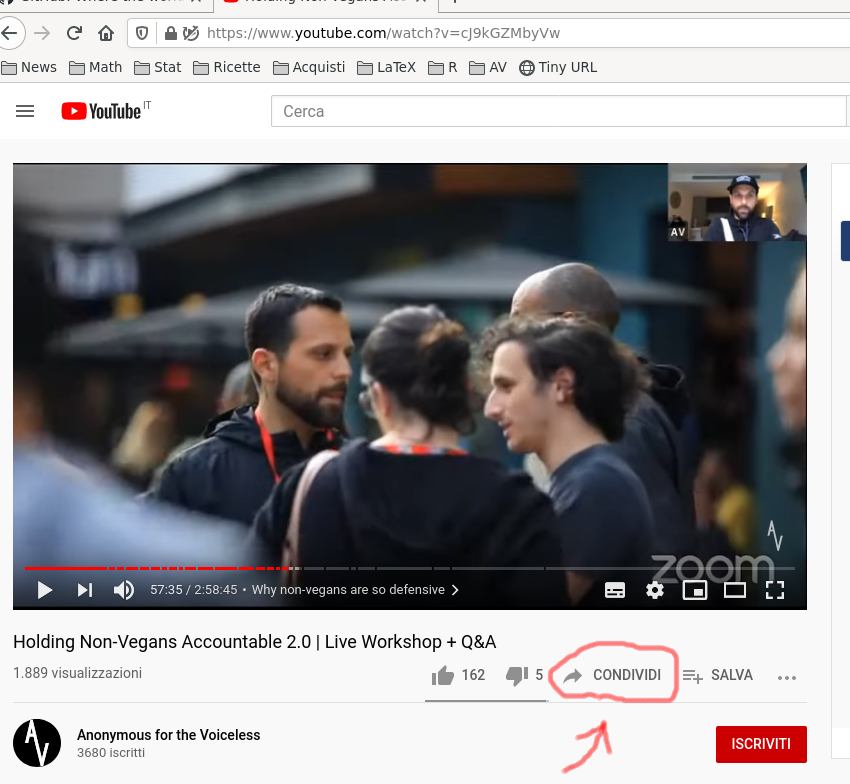

# Instructions for translators

**Resources**:
[[Language Guidelines]](https://drive.google.com/file/d/1GuYx3r637srhyxY2QYfKYO9Jbka-_gKd/view?usp=sharing),
Recommended [[Telegram Web]](https://web.telegram.org) or [[Telegram Desktop]](https://desktop.telegram.org/)


## Setup

In order to contribute to the translation, after reading the
 [linguistic guidelines](https://drive.google.com/file/d/1GuYx3r637srhyxY2QYfKYO9Jbka-_gKd/view?usp=sharing)
 you need to:

1. create (for free) an account on
   [GitHub](https://www.github.com) ("Sign Up" and follow the procedure
   up to email verification);
   
2. tell me your GitHub username for [authentication](../data/users.csv).

	A test file will be prepared: translate and submit it, *as shown below*.

	Once done, if you feel reasonably comfortable with the
    procedure go to the next step. Alternatively you can ask
	```
	@lucailgarb #sandbox
	```
	in order to try with another test file;

3. to request the assignment of a chunk of subtitles, post:
   
   ```
   @lucailgarb #translate
   ```


## The file we work on

The file on which we have to operate was generated by a speech-to-text
software starting from the original video.

Word recognition (when the audio is clear) is quite good; these
softwares, however, still have difficulties to understand vocal tones
(eg therefore to understand questions, punctuation etc).

Therefore is *essential* when you go to translate and prepare the
subs, to *listen/watch* the video.


### Subtitle format

The subtitles are to be put in a `.srt` file (a text file like
`.txt`) with a precise structure.

For example, below is an excerpt for the first few seconds of the
video that we use at cubes:

```
1
00:00:00,000 --> 00:00:01,200
Prodotti caseari

2
00:00:02,000 --> 00:00:24,000
Inseminazione forzata

3
00:00:33,000 --> 00:00:49,000
Separazione dei neonati

4
00:00:51,000 --> 00:01:04,000
Questa è una pratica standard
```

For each subtitle there is:
* a progressive number;
* starting and ending seconds of display;
* the text (which can be organized on several lines);
* a white dividing/ending line.

This file (translated in Italian) is what we will strive for.


### How / what to change

To allow linguistical **revision** , the translators work on a
*slightly different* file, which includes both the original and the
translated version. An excerpt / example of the file you will get:

```
3
00:00:33,000 -> 00:00:49,000
## Newborn separation


4
00:00:51,000 -> 00:01:04,000
## This is standard practice


```

What you will need to do is the following:
* leave **all unchanged**;
* **add the translated line (s)** in Italian below the English one;
* **leave at least one line of space** at the end.

As follows:
```
3
00:00:33,000 -> 00:00:49,000
## Newborn separation
Separazione dei neonati


4
00:00:51,000 -> 00:01:04,000
## This is standard practice
Questa è pratica standard


```


## The step-by-step process

To work on translations:

0. in the Telegram group "AV: Traduzioni and Sub YouTube" post:

	```
	@lucailgarb #translate
	```
	To request the assignment of a file to be translated.
	A message will be replied (as soon as possible) with the location of the
	file, something like:

	```
	subs/hnva2/subs_012000_lbraglia.srt
	```
	which means: it has been assigned 

	* the file `subs_012000_lbraglia.srt` (one chunk starting at approximately `01:20:00` in the video)
	* located in the `hnva2` folder (which contains subtitles for "Holding Non-Vegans Accountable 2.0")
	* located in the `subs` folder (which contains all subtitles of all videos).

1. from your **computer**, login on [GitHub](https://www.github.com);

2. open [this page](https://github.com/lbraglia/av_it_subs);

3. Then click on the `subs` folder
   
   

4. click on the video folder (`hnva2` in the example)

	

5. at this point it is a good idea **to save this page as bookmark** 
	because all the files of a given video are here.

   Then click on the name of the file that has been assigned to us
   (`subs_012000_lbraglia.srt` in the example);

   

6. now **view the work to be done as a whole**, following [the instructions below](https://github.com/lbraglia/av_it_subs/blob/main/doc/translate.md#il-workflow-da-adottare);

7. **once the full translation is clear**, you can click on the pencil
   button to edit the file (the one to the right of the `Raw` and`
   Blame` buttons);

   

8. make the changes/translate (don't worry about the message "You are
   making changes ... ")
   
   

   If you want to have a summary of the changes made, go for the
   `Preview changes` tab;

9. at the end of the session, when you want to "save", scroll down
   on the page, and find the `Propose changes` section: click on
   green button `Propose changes`

	

10. Click on the green `Create Pull Request` button
   
   

11. click on `Create Pull Request`;

	

12. and that's all folks !!


Following a minimal IT review the changes will be accepted and
integrated: changes that impact on anything different from translation
(e.g. subtitle id, seconds) will likely be rejected.

Now, if you **need to finish** the assigned file, restart from point 7
(take into account that the changes previously made do not will be
displayed if they have not been in the meantime approved. However they
were saved/not lost).

If, otherwise, you have **finished** your file:
* wait for acceptance/merge (communicated via email);
* *notify* in chat that the translation is complete
  by answering the assignment (to find it *search for your own
  GitHub username* in chat) with **translated**

	
 
  Once this is done you can, compatibly with your own availability
  **request a new assignment** by `@lucailgarb # translate`;

* at this point the file will be taken over by one of the reviewers
  (which will communicate **under review**). The auditor could confirm
  the translation, even making minor changes, by communicating
  **completed**; or it may request changes to the translators through
  comments as in the following template:

	```
	4
	00:00:51,000 -> 00:01:04,000
	## English to translate
	## English to translate
	Italian translated
	Italian translated
	## Reviewer's comment / request
	## Reviewer's comment / request
	```
  
  In this latter case, once the comments have been added, the reviewer
  will vi will communicate via Telegram the need to make the changes;
  to do them you will follow the same procedure described above. Once
  finished notify it to the auditor. The process will go on until the
  translation/linguistic revision is finished and the reviewer will
  report **completed**.

	


## The workflow to adopt

During translation **the worst way to proceed**, **definitely to
avoid**, consists in starting head down with the modification of the
subs on GitHub, proceeding one sub at a time, using Google Translate
and not listening to the video.

**What, vice versa, must be done:**

* point your browser to the url given at the beginning of the file;
  this is the link at the beginning of your segment in the video:

  

* it may be useful **to print** (on recycled paper) the subtitles, in
  order to have a useful support for annotations etc;
  
* **listen** the audio, several times for doubtful points, **visually
  scrolling the subtitles** at the same time. It's recommended
  listening to the previous and following pieces of the video too (for
  context);

* start **sketching** punctuation, translation, and highlighting
  *doubts*;

* don't hesitate to **ask / share any doubt they may be of use to
  others** in the chat "AV: Traduttori e Revisori". Some tips on how
  to do this are provided [here](help.md);

* if needed you can leave a comment to the reviewer such as follows:

	```
	3
	00: 00: 33,000 -> 00: 00: 49,000
	## Line 1 in English
	## Line 2 in English
	Translated text
	translated text
	## Comment for reviewers
	## comment for reviewers


	4
	...
	```

Note that the comment goes after *2 hashes*, as *last line* and making
sure there is always **at least one blank line of after separation**.

* once we have a complete idea of the translation and have resolved
  any doubts, we can **proceed with editing** the files;
  
* finally, if there are subs to be created from scratch (eg audio
  completely missing from text to speech or subs written on video to
  be translated) add in the `zz_UNSUBBED` file (in the same folder of
  the other files of the project, at the bottom) indicating the start
  time, English text, Italian translation, as follows:

	```
	00:00:33
	## English text
	Text translated into Italian

	...
	```

	Keep a dividing line between missing subs and place / keep
	in chronological order.

## Readability Guidelines for Translators

The received file is produced by a computer / software, and is still
"raw"; to obtain usable/professional subs is necessary adopt various
precautions, which will become automatic by practice.

For any doubt, as always, there is the chat "AV: Traduttori e Revisori".

Issue | Rule and / or example
------ | ---------------
Spelling / Grammar | Add punctuation, capitalization etc, correct any obvious grammatical errors of the speaker
Significance | Omit things like "um" "ah", omit repetitions "Thank you, thank you, thank you very much"
Sounds / Music | Describe *relevant* sounds/music, eg "(Creaking door)" or "(Creepy music)"
Inaudible | If you don't hear/understand and *it would seem relevant* put "[Inaudible]"
Dialogues | When two people speak in the same sub, each should have one line per sentence, starting with a hyphen.  Do place on several lines; then, if too many, the sub will later be split in such a way that it remains legible. For example ...
```
- Have you ever seen such images?
- No honestly, never like that.
- Ok, know that this is standard practice.
- Ah.
```
