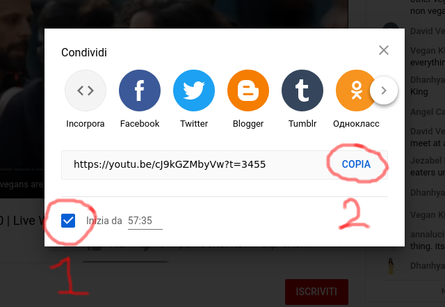
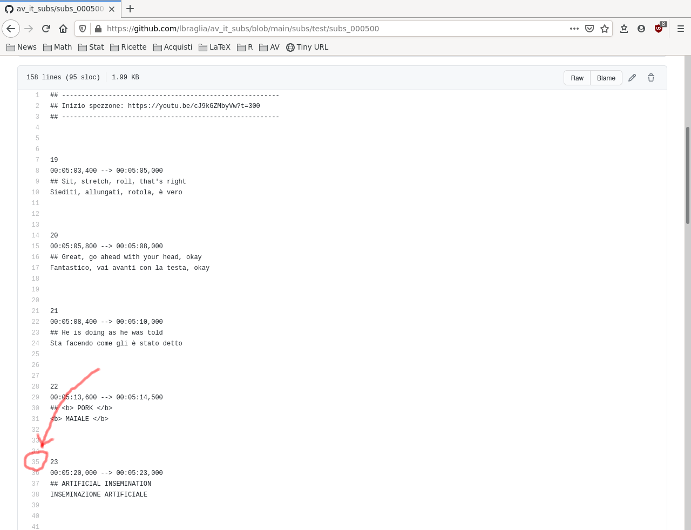
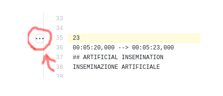
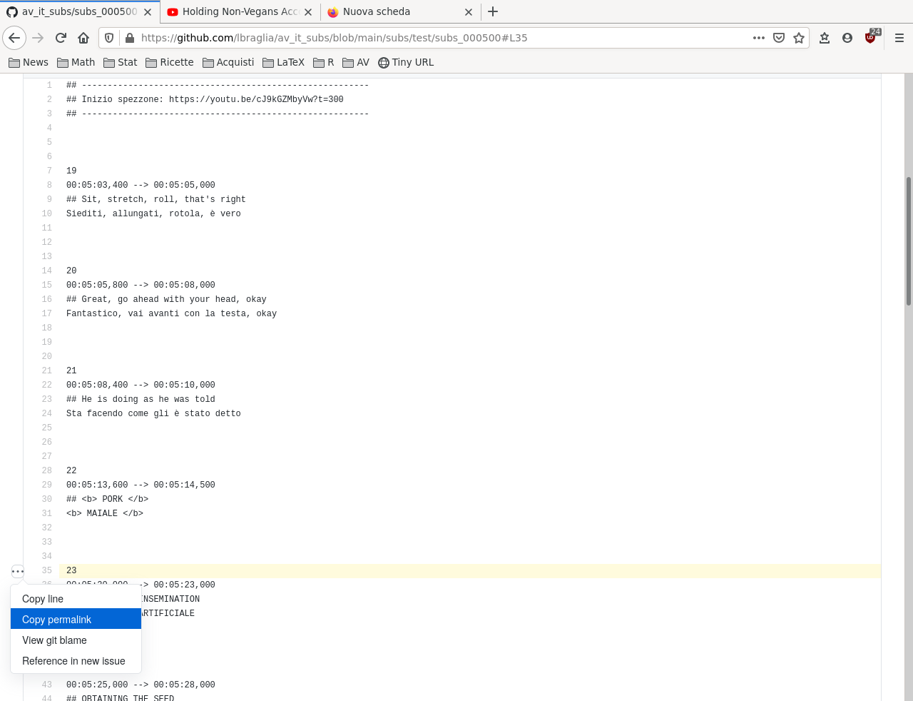

# Ottenere aiuto
In caso di dubbi/difficoltà:

* per **aspetti linguistici** non esitare a chiedere un parere/aiuto al gruppo
  "AV: Traduttori e Revisori";
* per **aspetti informatici** contattami direttamente.

Nel prosieguo ci concentriamo sulla richiesta aiuto per *aspetti
linguistici*. 

La cosa migliore che tu possa fare (per aumentare la facilità di
risposta) è un post dettagliato in "AV: Traduttori e Revisori"che
contenga:

* info sul punto di interesse (nel video YT con i sottotitoli inclusi);
* info sul dubbio/difficoltà.

Ad esempio (link fittizi):

```
Care/i, ho un dubbio su come tradurre verso questo punto:

https://youtu.be/cJ9kGZMbyVw?t=3455

In particolar modo sono indeciso su ...

Grazie as usual
``` 

Per costruire un post del genere:

* serve ottenere i link ad un determinato punto in YouTube: questo
  verrà spiegato *in seguito*;
 
* può essere molto comodo scrivere tale post da PC mediante [Telegram
  Web](https://web.telegram.org) (e se ti trovi bene ti consiglio di
  provare [Telegram Desktop](https://desktop.telegram.org/)).


## Ottenere il link al *video* in un dato punto

Come detto, a inizio del file da tradurre vi è un url che ti porta in
prossimità dell'inizio dei tuoi sottotitoli. Dobbiamo ottenere
qualcosa del genere per il punto del dubbio. 

Per farlo posizionati in tale punto sul video (in quello con i
sottotitoli, non nell'originale), dopodiché clicca su "Condividi":


In seguito clicca su "Inizia da" (per fare iniziare il video dal punto
selezionato) e poi su "Copia" per ottenere il link:



Dopodiché potrai incollare l'url nel post di richiesta d'aiuto.


<!-- ### Ottenere il link ai *subs* in un dato punto -->

<!-- Occorre visualizzare il file assegnato su GitHub (la schermata con la -->
<!-- matita ... *non* clicchiamo la matita perché non vogliamo effettuare -->
<!-- modifiche ora) e posizionarsi nei pressi del sottotitolo in questione (es -->
<!-- sottotitolo 23); clicchiamo sul numero della riga di interesse -->
<!-- (nell'esempio clicchiamo sul numero 35): -->

<!--  -->

<!-- Ci compaiono tre puntini e la linea viene evidenziata. Clicchiamo -->
<!-- dunque sui tre puntini: -->

<!--  -->

<!-- Dopodiché su copy permalink: -->

<!--  -->

<!-- Analogamente, nel seguito, si potrà incollare l'url nel post di -->
<!-- richiesta d'aiuto. -->
