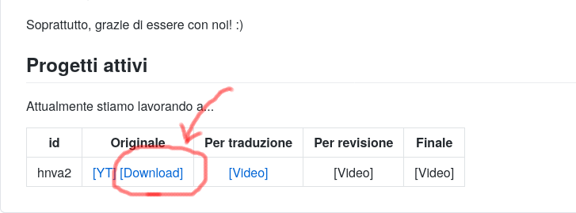

# Istruzioni per revisori


Risorse | Link 
--------|:----:
Obbligatorie | [[Linee guida]](https://drive.google.com/file/d/1IACZxWdk84rs81ElQ9OWws-aroQZDtxZ/view?usp=sharing), [[Aegisub]](http://www.aegisub.org/)
Consigliate | [[Telegram Web]](https://web.telegram.org), [[Telegram Desktop]](https://desktop.telegram.org/)


## Il file su cui lavoriamo per la revisione

Il file su cui dobbiamo operare è stato creato durante il processo di
traduzione.

## Setup

Per poter effettuare revisioni per un dato video, dopo aver letto le [linee
guida](https://drive.google.com/file/d/1IACZxWdk84rs81ElQ9OWws-aroQZDtxZ/view?usp=sharing) occorre:

1. installare [Aegisub](http://www.aegisub.org/), il programma con cui
   verrà controllato il proprio spezzone. Per quanto riguarda Windows
   è possibile eventualmente optare per la versione portabile (che non
   richiede installazione e quindi i permessi di amministratore sulla
   macchina);

2. scaricare (la prima volta) il video: il link si trova nella [pagina
   principale](README.md), ad esempio (per hnva2) qui:

	

3. periodicamente (quando disponibili) nel gruppo Telegram "AV:
   Traduzioni e Sub YouTube" verrà comunicata la disponibilità di file
   per la revisione. Si può richiedere una assegnazione mediante:
   
	```
	@lucailgarb #revise
	```

4. ottenere lo spezzone assegnato: TODO


## Il workflow da adottare


## Ottenere aiuto
In caso di dubbi/difficoltà:

* per **aspetti linguistici** non esitare a chiedere un parere/aiuto al gruppo
  "AV: Traduttori e Revisori" seguendo [queste istruzioni](help.md);
* per **aspetti informatici** contattami direttamente.

## Istruzioni per i revisori

